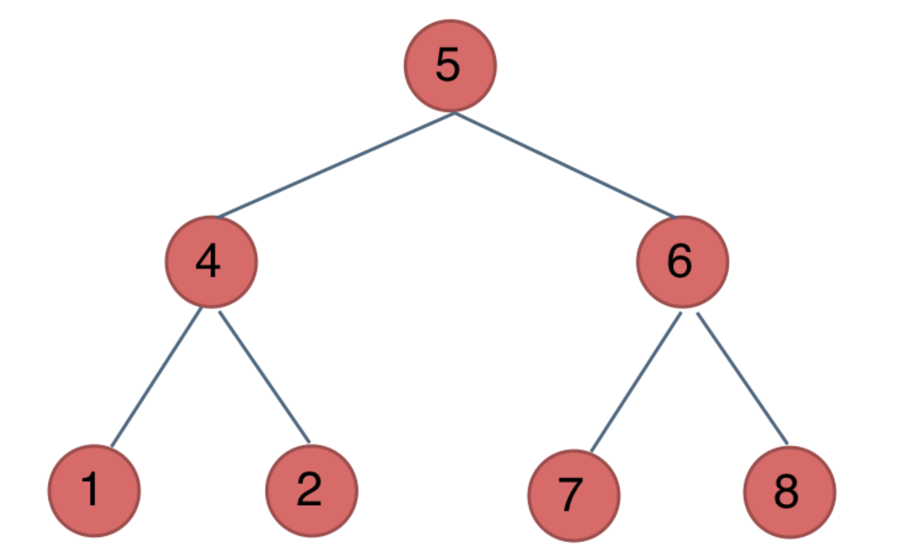

## 关于二叉树遍历

#### 二叉树遍历的前中后都是针对根节点，这样比较好记
- 前序：根 左 右
- 中序：左 根 右
- 后序：左 友 根

#### e.g:

- 前序：5 4 1 2 6 7 8
- 中序：1 4 2 5 7 6 8
- 后序：1 2 4 7 8 6 5

#### 通常有递归和迭代两种方式

- leetcode题目编号为 前序（144） 后序（145） 中序（94）

- 递归（见dft_sort.go文件）：思路比较简单，遇到根节点则读取值，不是则按对应顺序递归即可，遇到空节点则退出